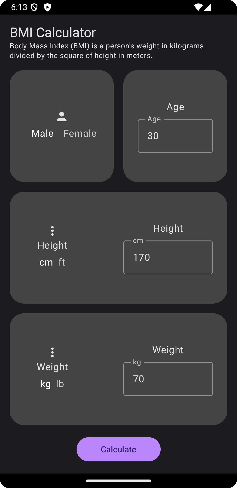
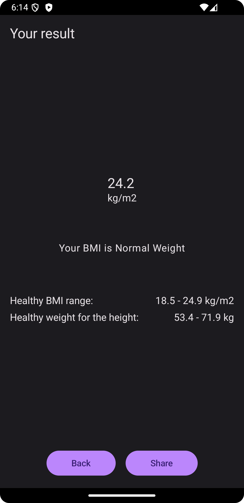

# KotlinPlayBMIApp
This is a simple BMI calculator app written in Kotlin. It is a part of the Kotlin Play series.

## Dribbble Inspiration
[https://dribbble.com/shots/23104842-DailyUI-004-BMI-Calculator](https://dribbble.com/shots/23104842-DailyUI-004-BMI-Calculator)

## Screenshots
- Home screen
  - 
- Results screen
  - 

## Features
- Calculate BMI
- Show BMI Category
- Share BMI

## Concepts Used
- Navigation (Navigation to multiple screens)
- ViewModel (ViewModel for data persistence across screens)
- Intents (Share via SMS)

## Libraries Used
- [Material Components](https://material.io/develop/android/docs/getting-started/)
- [Navigation Component](https://developer.android.com/guide/navigation)
- [ViewModel](https://developer.android.com/topic/libraries/architecture/viewmodel)

## License
```
MIT License
```

## Developed By
```
Cody Weber
```